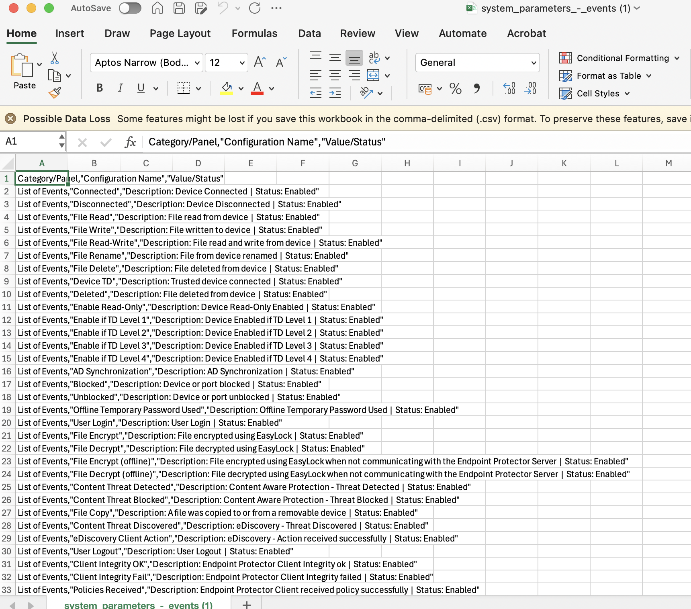
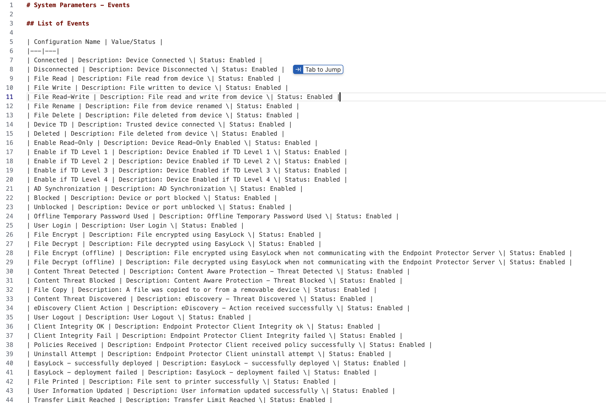
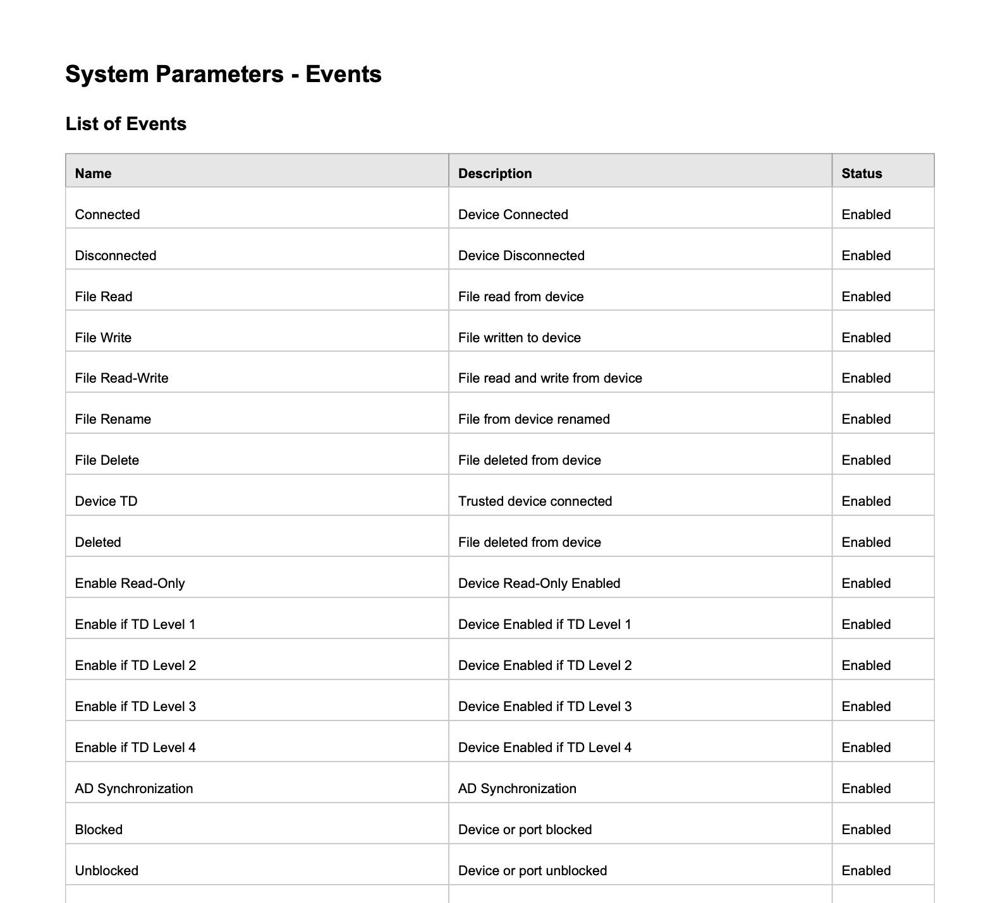

# Netwrix Config Exporter

A Chrome extension (Manifest V3) that exports configuration data from a
Netwrix Endpoint Protector (EPP) admin console to CSV, Markdown, or PDF, and
dashboard charts to PNG, so you don't have to manually copy settings out of
the UI.

## Features

- One-click "Export Current Page" that reads whatever Netwrix EPP page is
  open in the active tab and downloads it in your chosen format.
- Export format choice: CSV, Markdown, or PDF.
- Dedicated navigation buttons for ~50 common pages (Device Control, Content
  Aware Protection, Denylists and Allowlists, Reports and Analysis, Alerts,
  Directory Services, Appliance, System Maintenance, System Configuration,
  System Parameters, Dashboard) that jump to the page and export it in one
  click. Full list in [help.html](help.html#3-available-buttons).
- Dashboard PNG export: preset buttons (1 week / 2 weeks / 1 month) for the
  General, Device Control, and Content Aware dashboards. Drives the
  date-range picker with genuinely trusted clicks (via `chrome.debugger`,
  since the picker ignores script-dispatched clicks), then zooms the tab out
  until the whole dashboard fits before capturing (Netwrix's layout scrolls
  internally rather than growing the page).
- Handles both UI frameworks used across the app: the older ExtJS-based
  pages (`.x-panel`) and the newer Bootstrap-based pages (`.panel-epp`).
- Auto-expands collapsed accordion panels and inactive tabs before
  extracting, so a single export captures data you never manually opened.
- Auto-sets paginated list tables (e.g. System Parameters > Events) to show
  all entries before extracting, instead of only the first page.
- Waits for AJAX-loaded tables (e.g. Devices, System Administrators) to
  finish rendering before extracting, instead of assuming a fixed delay.
- List pages get a real multi-column PDF table matching the page's own
  columns (landscape automatically for wide tables), instead of squashing
  every column into one cell.
- Skips password fields by design.
- Built-in help page (accessible from the popup) with setup and usage
  instructions.

## Installation

1. Open `chrome://extensions` in Chrome.
2. Turn on **Developer mode** (top-right toggle).
3. Click **Load unpacked** and select this folder.
4. Confirm it appears as "Netwrix Config Exporter" with no errors.

## Usage

1. Open your Netwrix EPP admin console in a browser tab and make sure it is
   the active tab.
2. Click the extension icon to open the popup.
3. Pick a format (CSV / Markdown / PDF), then click a section button
   (auto-navigates and exports), or navigate to any page yourself and click
   **Export Current Page** - or click a Dashboard PNG Export button.
4. The file downloads automatically.

See the in-extension Help page (click "Help" in the popup) for the full list
of available buttons and known limitations.

## Example exports

Examples below are from the System Parameters > Events export, which lists
Netwrix's built-in event type definitions - no environment-specific or
sensitive data.

| CSV | Markdown | PDF |
|---|---|---|
|  |  |  |

## Files

| File | Purpose |
|---|---|
| `manifest.json` | Extension manifest (Manifest V3) |
| `content.js` | Injected into the Netwrix EPP page; does the DOM extraction and CSV/Markdown/PDF download |
| `popup.html` / `popup.js` | Extension popup UI: format selector, page navigation buttons, export triggers |
| `background.js` | Service worker; drives the dashboard date-range picker via `chrome.debugger` and captures/downloads the PNG |
| `help.html` | In-extension user guide, opened from the popup |
| `lib/jspdf.umd.min.js` | Bundled [jsPDF](https://github.com/parallax/jsPDF) library (MIT license), used for PDF export |
| `docs/screenshots/` | Example export screenshots used in this README and help.html |

## Known limitations

- List pages (e.g. "Content Aware Policies") export the summary table, not
  each item's full detail. Open an item's Edit page manually and use
  **Export Current Page** for full detail on one item.
- The extension cannot auto-open individual rows (policy edit screens,
  custom class detail views, etc.) because Netwrix's row-action menus only
  respond to real user clicks, not script-simulated ones. Section buttons
  only cover pages reachable directly from the main sidebar.
- Dashboard PNG export requires the `debugger` permission, so Chrome shows a
  "started debugging this browser" infobar for the few seconds an export
  takes, and briefly zooms the tab out while capturing.
